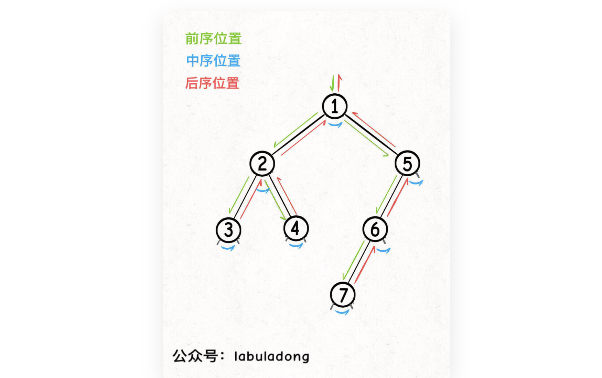

# 第一章

## 动态规划

动态规划问题的一般形式是求最值。求解动态规划的核心问题是穷举。

动态规划问题的三要素：最优子结构、状态转移方程、重叠子问题。

1. 只有正确的状态转移方程，才能正确的穷举；
2. 是否具有最优子结构，是否能通过子问题的最值得到原问题的最值；
3. 重叠子问题，使用暴力解法会导致穷举效率低下，需要使用备忘录优化穷举过程。

状态转移方程思考的思路：

明确basecase，明确状态，明确选择，定义dp数组、函数的定义

### 两种框架：

1、自顶向下，递归

```
func main() {
  func dp(状态1, 状态2) result {
    for 选择 = range 所有可能得选择 {
      result = 求最值(result, dp(状态1, 状态2))
    }
    return result
  }
}
```

2、自底向上

```
func main() {
	dp := make() // 1.初始化 basecase
	//2.进行状态转移
	for 状态1 := range 状态1的所有取值 {
		for 状态2 := range 状态2的所有取值 {
			dp[状态1][状态2] = 求最值(选择1, 选择2, ...)
			//3.求result
		}
	}
	//4.result就在dp中，或由dp的值计算得到。
}
```

## 回溯

解决回溯问题就是一个决策树的遍历问题，站在一个回溯树的一个节点上，只需要考虑3个问题：

- 路径：已经做出的选择
- 选择列表：当前可以选择的路径
- 结束条件：到达决策树的底层，无法再做选择的条件

```
func main() {
	res := [][]int{}
	var dfs func(路径, 选择列表)
	dfs = func(路径，选择列表) {
		if 满足条件:
		{
			res = append(res, 路径)
			return
		}
		for 选择 = range 选择列表 {
			做选择
			dfs(路径, 选择列表)
			撤销选择
		}
	}
}
```

递归调用之前 做选择 ，递归调用之后 撤销选择。

## BFS

解决的问题：在图中，找到从起点到终点的最近距离。BFS找到的路径一定是最短的，但是空间复杂度要高很多。

实现：用队列，每次将一个节点周围的所有节点加入队列。

框架：

```
func main() {
	var start Node
	var target Node
	q := []*Node{}
	visited := map[*Node]bool{}
	q = append(q, start)		// 起点加入队列
	visited[start] = true
	step := 0
	for len(q) > 0 {
		sz := len(q)
		// 队列中的所有节点向四周扩散
		for i := 0; i < sz; i++ {
			Node cur := q[0]
			q = q[1:]
			// 判断是否达到终点
			if cur == target {
				return step
			}
			// cur的相邻节点加入队列
			for x := range Node.adj() {
				if (visited[x] == false)
				{
					q = append(q, x)
					visited[x] = true
				}
			}
		}
		// 更新步数
		step++
	}
}
```

## 二叉树

### 二叉树的思维

遍历：问题是否可以通过遍历一遍二叉树获得。用遍历函数+外部变量实现

递归：定义一个递归函数，通过子问题的答案推导出原问题的答案

两种思维的核心：单独抽出二叉树的一个节点，给出需要此节点做的事情，和什么时候（前、中、后序遍历位置）做这些事情。

### 快排和归并排序

快排框架——前序遍历：

```
func sort(nums []int, lo int, hi int) {
	// 前序遍历位置
	// partition，找到切分点p，p的左边比nums[p]小，p的右边比nums[p]大
	p := partition(nums, lo, hi)
	sort(nums, lo, p-1)
	sort(nums, p+1, hi)
}
```

归并排序框架——后续遍历

```
func sort(nums []int, lo int, hi int) {
	m := (lo + hi) / 2
	sort(nums, lo, p-1)
	sort(nums, p+1, hi)
	// 后续遍历位置，合并nums[lo:m]和nums[m+1:hi]
	merge(nums, lo, m, hi)
}
```

### 前、中、后序遍历

前、中、后序是遍历二叉树过程中处理每个节点的三个特殊的时间点：

- 前序：在进入二叉树节点的时候进行；

- 后续：在离开二叉树节点的时候进行；

- 中序：遍历左子树后，将开始遍历右子树时候进行。

对于每个节点都有自己的前、中、后序位置。


中序遍历常用于二叉搜索树中。

### 后序遍历的特点

对于那些对前中后序不敏感的代码，可以写在前序遍历中。前序遍历位置只能从函数参数中获取父节点传来的数据，后序遍历位置不仅可以获取参数中的数据，还可以获取到子树通过函数返回值传回来的数据。

比如：节点在第几层，从根节点遍历过来时就能记录下来；节点的子树中有多少节点，就需要遍历完子树后才能清楚。

后序遍历的使用场景：


